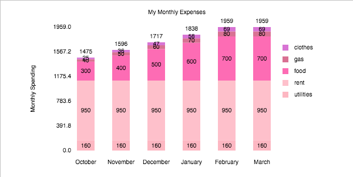
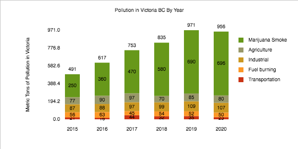
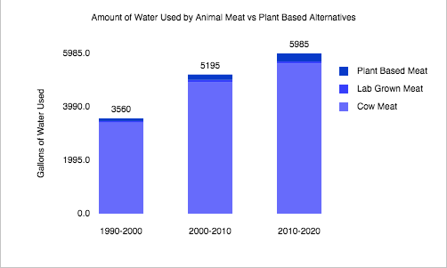
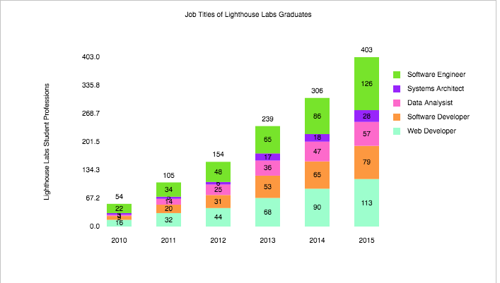

# Bar-Chart
Lighthouse Bar chart stretch project. 

### About. 

This is the prep work strech project for Lighthouse Labs Web Dev course March 2021. 
The Bar Chart program can display stacked or simple bar charts, with dynamic sizing and labelling. 

### Screenshots. 

### API Functions. 

**drawBarChart(dataStack, options, element)** 

- Main function to draw chart. Takes in dataStack (object), options (object), and element (html canvas).
- calls drawTitle and drawStackedBars

**drawStackedBars(dataStack, options, element, ctx)** 
- Draws a stacked bar chart based on data inputted.
- Calls drawAxis, largestVal, checkTextPos, and drawLegend

**drawLegend(dataStack, options, ctx, element)**
- Draws a legend with labels and color coded squares 

**drawTitle(dataStack, element, ctx)**
- Draws a title in the top middle of the canvas

**drawAxis(data, options, element, ctx, dataStack)**
- Draws y axis values at even increments. number of increments can be changed in options. 
- also draws y axis label

**largestVal(data)**
- Checks an array of values and returns the largest

**checkTextPos(pos)**
- for checking options.textPos for the position of values on each bar.
- returns a multiplier for positioning the text (0, 0.5, or 1)

**drawBars(data, options, element, ctx, dataLabels)**
- original draw function, now obsolete but left in for emotional support

### Features/Options

**Options Object**
contains values for:
- width and height
- barSpace: can be set to default to evenly size bars and spaces.
- textPos: use "bottom", "middle", or "top" to change where individual value labels sit on the bars
- fillColour: only for drawBars
- textColour: default colour for legend, y axis values and drawBars
- widthMultiplier: value between 0 and 1, adjusts relative width inside canvas
- heightMultiplier: value between 0 and 1, adjusts relative height inside canvas
- axisNums: adjusts the number of y axis values displayed
- displayTotals: true or false, display total of stack on top of bars
- displayValues: true or false, display values inside of bars

**dataStack Object**
contains values for:
- data: a 2d array storing all bar values, with the first stack of data being data[0], second data[1] etc. data[0][1] would be the second value in the first stack.
- colours: a colour array for the respective data values. colours[0] would be the first layer, colours[1] the second, etc.
- labels: an array of x axis labels for each stack.
- labelColours: an array of colours for each label.
- legend: an array containing the name for each layer of values.
- yAxisLabel: string for y axis label.
- title: string for title  

### Known Issues/Bugs

No known bugs, some issues include being able to size the graph so that it is unreadable, and having the y axis values not snap to rounded numbers.

### Roadmap

To implement:
- text fields to generate new graphs within the site
- sliders to adjust width and height
- functions to enable removing/adding new charts
- better y axis labelling
- pretty up the site with a nice header, maybe a navigation section to an about page and a chart creator page

### Resources

https://www.w3schools.com/
https://developer.mozilla.org/en-US/docs/Web/JavaScript
https://stackoverflow.com/

# Thanks for reading!
